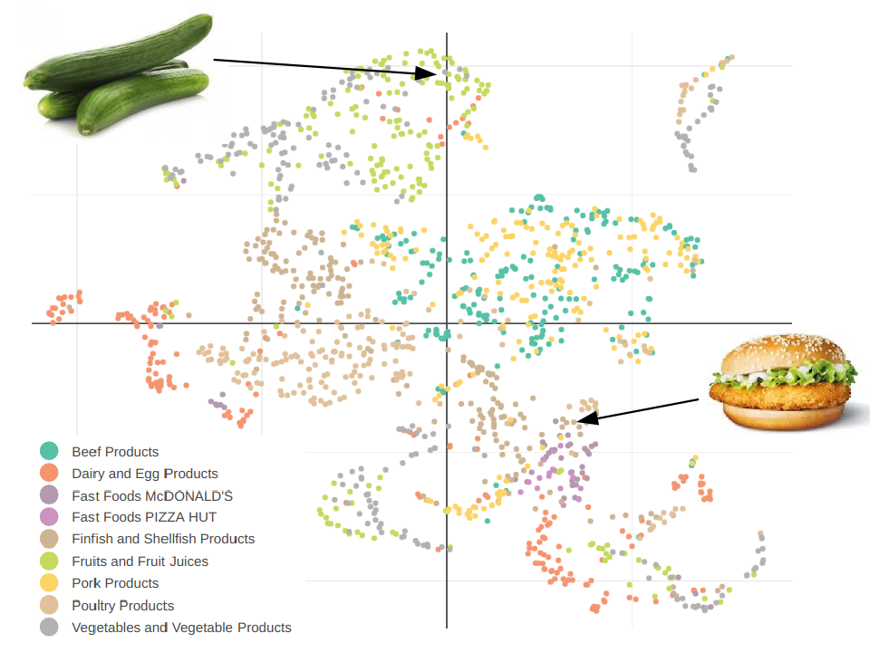

# foodcomposition
R scripts to do analysis on food nutrient values using umap. You can get food nutrient data from [the USDA food composition data bases](https://ndb.nal.usda.gov/ndb/search/list).

